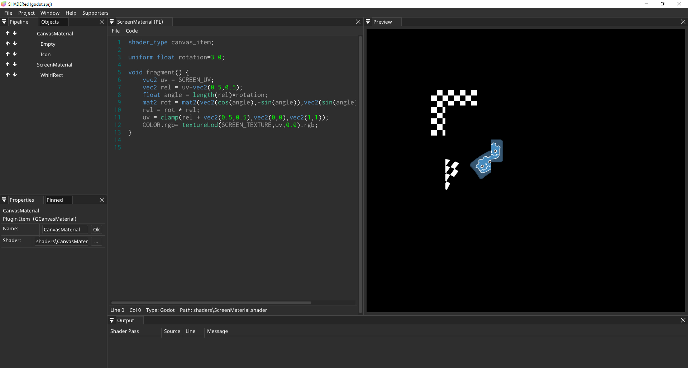

# PluginGodotShaders
SHADERed plugin that adds support for Godot Shaders. This plugin adds several new pipeline items: CanvasMaterial, Sprite, Quad2D & BackBufferCopy.



## How to build
Clone the project:
```bash
git clone https://github.com/dfranx/PluginGodotShaders.git
git submodule init
git submodule update
```

### Linux
Install required libraries:
```bash
# Ubuntu
sudo apt install libglew-dev libglm-dev libgtk-3-dev
# Fedora
sudo dnf install glm-devel glew-devel gtk3-devel
```

Build:
```bash
cmake .
make
```

### Windows
1. Install GLEW & GLM through your favourite package manager (I recommend vcpkg)
2. Run cmake-gui and set CMAKE_TOOLCHAIN_FILE variable
3. Press Configure and then Generate if no errors occured
4. Open the .sln and build the project!

## How to use
Copy the .dll/.so file to plugins/GodotShaders in your SHADERed installation directory

## TODO
- light shaders
- shader\_type spatial
- particle shaders
