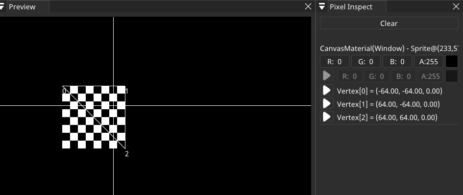

# PluginGodotShaders
SHADERed plugin that adds support for Godot Shaders. This plugin adds several new pipeline items: CanvasMaterial, Sprite & BackBufferCopy.


## How to build
Clone the project:
```bash
git clone https://github.com/dfranx/PluginGodotShaders.git
git submodule init
git submodule update
```

### Linux
Install required libraries:
```bash
# Ubuntu
sudo apt install libglew-dev libglm-dev libgtk-3-dev
# Fedora
sudo dnf install glm-devel glew-devel gtk3-devel
```

Build:
```bash
cmake .
make
```

### Windows
1. Install GLEW & GLM through your favourite package manager (I recommend vcpkg)
2. Run cmake-gui and set CMAKE_TOOLCHAIN_FILE variable
3. Press Configure and then Generate if no errors occured
4. Open the .sln and build the project!

## How to install
This plugin's minimum requirements: SHADERed v1.3.5

Copy the .dll/.so file to `plugins/GodotShaders` folder in SHADERed's installation directory

## Tutorial
First, create an empty SHADERed project. Right click on the "Pipeline" window.


`GCanvasMaterial` is actually just a interface for canvas shader. GCanvasMaterial's children
will use the same shader (that is specified in this item's properties).

`GBackBufferCopy` will update the contents of SCREEN\_TEXTURE.

Click on `GCanvasMaterial`. The newly added item will appear in the "Pipeline" window.
Right click on it and select properties.


In the properties you can:
 - rename the item
 - specify shader file
 - select render texture


Create an empty `.shader` file. Select it in the GCanvasMaterial's properties.
Copy and paste the following code:
```glsl
shader_type canvas_item;

uniform float uMultiplier;

void vertex()
{
	VERTEX.x += cos(TIME) * uMultiplier;
	VERTEX.y += sin(TIME) * uMultiplier;
}
```

To edit the CanvasMaterial's code in SHADERed, either double click the item in Pipeline window or `right click -> Edit -> Shader`

We should now add a sprite to the scene. Right click on your GCanvasMaterial item -> Add -> GSprite.
It will prompt you to select a texture (NOTE: this can be changed later in the properties).


You should now have something like this:


As you can notice, the sprite isn't moving. That's because our
uniform variable `uMultiplier` is set to zero by default. To edit it's
value, right click on `GCanvasMaterial` -> Uniforms. Enter the value (either by dragging or by double clicking on the textbox)


Here are the results:


To debug your shader, first pause the preview. You can do that by either pressing the `Space` key or the pause button on the statusbar.
After that, select a pixel that you want to debug by clicking on the preview window.
Additional information should appear in the "Pixel Inspect" and "Preview" windows.



As it can be seen in the screenshot, you cannot debug the fragment shader
since it isn't provided in our tutorial's shader (the `fragment()` function is missing).
To start debugging the vertex shader, press the "play" button near one of the vertices.
You can step through the code line by line and hover over variables to see their value.


This project is provided with the plugin. Check the `examples/GodotSimple` directory.